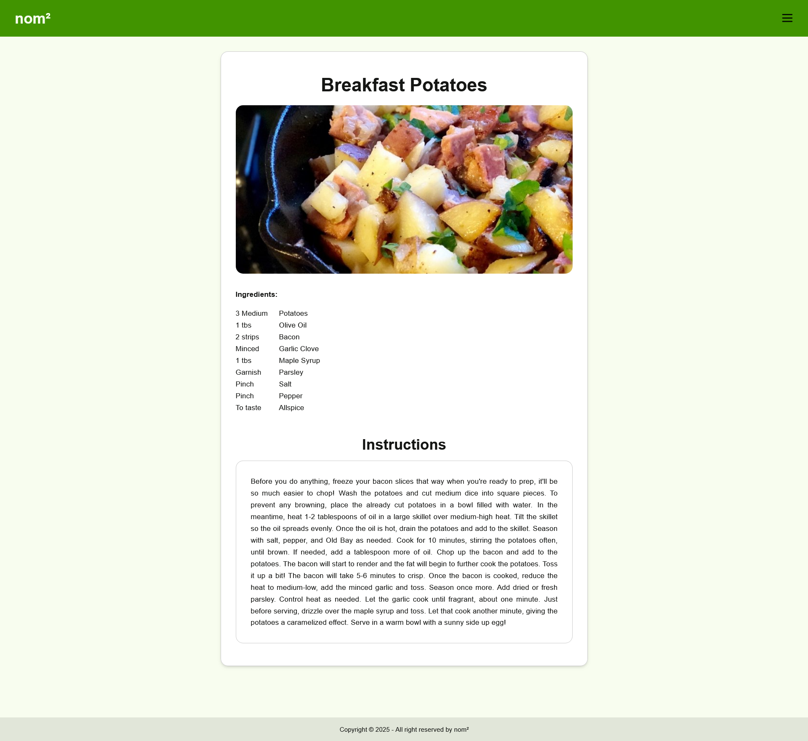

# REACT RECIPE PAGE

React Recipe Page is a web application that allows users to browse and search for recipes from the <b>Recipe DB</b>. 
The project is a playground to practice <b>React</b>, <b>TypeScript</b>, <b>Vite</b>, <b>CSS</b>, and <b>DaisyUI</b>, 
while building a clean and responsive user interface.

<p align="center">
  
  
</p>

## FEATURES

<p>
- Browse and search recipes using <b>Recipe DB API</b>.<br>
- Responsive layout with <b>DaisyUI</b> components.<br>
- Clean and intuitive <b>React + TypeScript</b> code structure.<br>
- Smooth interactions and visually appealing UI.
</p>

## TECH STACK

<p>
Frontend: React, TypeScript, Vite<br>
Styling: CSS, DaisyUI<br>
API: <a href="https://www.themealdb.com/">Recipe DB</a>
</p>

### CODE SNIPPET

<p align="center">
Example of fetching data from the Recipe DB API:
</p>

```typescript
  type Category = {
    idCategory: string;
    strCategory: string;
    strCategoryThumb: string;
    strCategoryDescription: string;
  };

  useEffect(() => {
    async function fetchCategories() {
      try {
        const response = await fetch(
          "https://www.themealdb.com/api/json/v1/1/categories.php"
        );

        if (!response.ok) {
          throw new Error(`HTTP-Error! Status: ${response.status}`);
        }

        const data = await response.json();
        const categories: Category[] = data.categories;

        setAllCategories(categories);
        const initial = categories.filter((cat) =>
          featured.includes(cat.strCategory)
        );
        setVisibleCategories(initial);
      } catch (err) {
        console.error("Couldn't load categories", err);
      }
    }
    fetchCategories();
  }, []);
```
